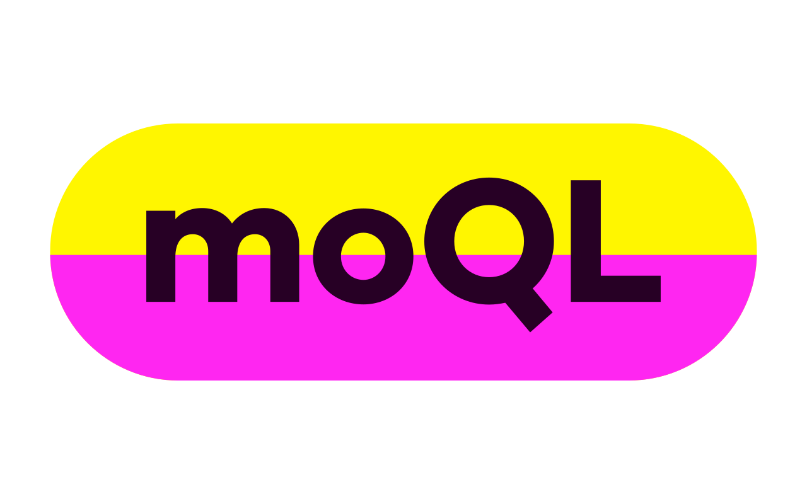

[](https://www.npmjs.com/package/moql)

## moQL: Mock GraphQL query server for tests.

From your Jest (or other framework) specs, easilly start a mock GraphQL server, set mock data to return, and verify it was actually requested by your GraphQL client (framework agnostic). Used and supported by [eola](https://compass.eola.co).

It lets you write proper integration tests without running your backend server, but also without mocking out all of your GraphQL code. Real GraphQL, real network requests, reliable testing.

### Example

Using JEST and Enzyme JSDOM to test a React component, but can be adapted to any test setup and frmaework as moQL doesn't depend on anything — it just provides some methods and an HTTP server.

```js
import { moQL, startMoQL, stopMoQL, verifyMoQL } from 'moql'
import waitForExpect from 'wait-for-expect'
import { mount } from 'enzyme'

// React component definition omitted
import Yard, {
  PEOPLE_QUERY // In this case a "graphql-tag" `gql` query
} from '../src/Kelis/Yard'

beforeAll(startMoQL) // Automatically waits until server is started
afterEach(verifyMoQL) // Optional check that all mocks were used
afterAll(stopMoQL)

// Mock a query and response.
// As your mocks grow you can put them in separate files and import.
const peopleMock = () =>
  moQL({
    request: {
      query: PEOPLE_QUERY.loc.source.body, // Query as plain text
      variables: { bait: 'Milkshake' } // will be strictly matched
    },
    response: {
      // Copy paste from your live API or hand craft some dummy data
      data: {
        people: [
          { id: '1', name: 'Callum', __typename: 'Person' },
          { id: '2', name: 'Daniel', __typename: 'Person' },
          { id: '3', name: 'Jamie', __typename: 'Person' },
          { id: '4', name: 'Simon', __typename: 'Person' }
        ]
      }
    }
  })

describe('Yard', () => {
  it('brings all the boys', async () => {
    peopleMock() // Registers the mock with moQL

    const yard = mount(
      // Pass in moQL's URL and port (this is the default)
      <Yard graphqlUri="http://localhost:7332/graphql" bait="Milkshake" />
    )

    await waitForExpect(() => {
      yard.update() // Re-renders React until the data loads in
      expect(yard.find('.person#p2 .name').text()).toEqual('Daniel')
    })
  })
})
```

### API documentation

Use the moQL mothods in this flow:

```js
startMoQl() // before suite or test group
moQL(...) // inside test to register mock
verifyMoQL() // after each test (or `resetMoQL()` for flaky tests)
stopMoQL() // after suite or test group
```

Note: you can leave out the `verifyMoQL()` or `resetMoQL()` step if all or your tests share the same mocks but it's not recommended because your tests will become order dependent and tightly coupled.

#### moQL

The primary method for registering a mock with moQL. You tell moQL the GraphQL query and variables you are expecting to be requested and the data you'd like to be returned, then if a matching query is made during your test moQL will respond with the data you set up. If a different query or variables is actually requested it will throw a helpful error telling you, so you can either fix your app or change your mock. If your app makes multiple requests you can mock all of them. If you forget to mock any it will tell you. See [verifyMoQL](#verifyMoQL) for verifying that all mocked queryies were actually used.

```js
moQL({
  request: {
    query: '{}', // (required) expected GraphQL query String
    variables: {} // (optional) expected GraphQL variables JSON Object
    // if JSON Object it strictly checks those exact variables are specified.
    // if `{}` or `undefined` it strictly checks no variables are specified.
    // if `null` it loosely ignores whether variables are specified or not.
  },
  response: {
    data: {} // (required) desired GraphQL response JSON Object
    // [Copy paste from a live API response or hand craft some sample data]
  }
})
```

#### startMoQL

Start the moQL server, by default on: `http://localhost:7332/graphql`

This method is asynchronous so you need to wait for it to finish starting before you can run tests; JEST's `beforeAll` automatically waits. The same server instance can be used for all moQL specs so you only need to start it once for performance.

```js
// Run before suite or test group
startMoQL()
// Start moQL server on a custom port if necessary
startMoQL({ port: 7332 })
```

#### stopMoQL

Stop the moQL server.

```js
// Run after suite or test group
stopMoQL()
```

#### verifyMoQL

Verifies all the mocks you registered were actually used by your app, and resets them between tests (so future tests don't have extra mocks registered). It is useful to verify because a mock not being used either means your test can be simplified, or your app is broken and no longer requesting data it should be! You'll likely also want to assert in your tests that the data loaded is also rendered in your UI, but this verification is a great "free" sanity check. There's no need to call `resetMoQL` as well, `verifyMoQL` does it for you!

```js
// Run after each spec
verifyMoQL()
```

#### resetMoQL (prefer verifyMoQL instead)

Resets the mocks between tests (so future tests don't have extra mocks registered), without verifying that they were actually used. You may need to use this if your tests are flaky and your app intermittently doesn't load a particular query, but it's not recommended.

```js
// Run after each spec (prefer verifyMoQL instead)
resetMoQL()
```

### Motivations

Many suggestions for testing apps that use a GraphQL API amount to "refactor your code so it's more testable, then mock everything syncronously". Testable can also mean easier to understand, or it can become layers of indirection and wasted developer hours. Sometimes we can't refactor the code anyway if it's in a 3rd party library or we have deadlines to meet. With moQL you can test your app just like you'd run it.

#### Real HTTP

You want at least 1 integration test that actually hits the network as a real user would, right?

#### Framework agnostic

MoQL should work nicely with any frontend framework, GraphQL client, and test setup. It's just a bunch of methods in a module that you can call from wherever. We're using moQL with React, Apollo, Enzyme JSDOM and Jest.

#### Fast and simple

There's 1 HTTP request per query actually requested (as you'd expect) and very little overhead beyond that. You can start the server just once at the beginning of your spec file (or whole suite).

#### Helpful

If an unexpected query was made, it'll tell you. If you expected a query to be made but it wasn't, it tells you that too. Less banging your head on black boxes, more helpful error messages.

### Development

There's not much code, and it doesn't do anything fancy. The only dependency is Express, and it's used lightly. Test coverage is good, and we've battle tested moQL in production at [eola](https://compass.eola.co).

Issues and PRs welcome. Please run ESlint, Prettier and Jest if you can :)

**TODOs** (good first PRs):

- Make terminal output confgurable so you can hide it.
